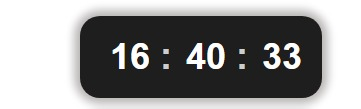
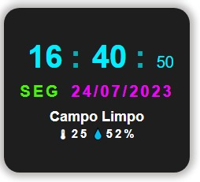

# relogio_smart
 o principal objetivo desse relogio é passar as informações correta de porcentagem de chuva temperatura atual e sim a hora.. projeto conectado com uma api que fornece esses dados projeto feito para aperfeisoar o Javascript...

 <h1>Smart Web</h1>

O Smart Web é um relogio digital. onde você pode conferir Data hora e temperatura como você pode ver nas imagens aqui em baixo..

 
 

 
 

Essa sessão temos um conteudo de horas para que os usuarios tenha mas agilidade em verificar a hora no seu dia a dia

 
 

    

 
 

essa sessão temos um relogio smart que exibira temperatura.   a humildade do AR e data, horas.
super pratico e rapido para que seu dia a dia seja aproveitado o maximo possivel

 
 

    

 
 

Esse é o conteudo da pagina inteira com dois paineis de Relogio para que seja simples rapido e facil verificar a hora e a temperatura em um só lugar pra você aqui e agora

